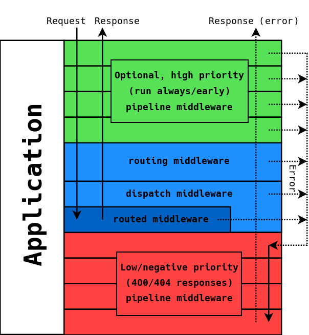

# Overview

Expressive allows you to write [PSR-7](http://www.php-fig.org/psr/psr-7/)
[middleware](https://github.com/zendframework/zend-stratigility/blob/master/doc/book/middleware.md)
applications for the web.

PSR-7 is a standard defining HTTP message interfaces; these are the incoming
request and outgoing response for your application. By using PSR-7, we ensure
that your applications will work in other PSR-7 contexts.

Middleware is any code sitting between a request and a response; it typically
analyzes the request to aggregate incoming data, delegates it to another layer
to process, and then creates and returns a response. Middleware can and should
be relegated only to those tasks, and should be relatively easy to write and
maintain.

Middleware is also designed for composability; you should be able to nest
middleware and re-use middleware.

With Expressive, you can build PSR-7-based middleware applications:

- APIs
- Websites
- Single Page Applications
- and more.

## Features

Expressive builds on [zend-stratigility](https://github.com/zendframework/zend-stratigility)
to provide a robust convenience layer on which to build applications. The
features it provides include:

- **Routing**
  
  Stratigility provides limited, literal matching only. Expressive allows you
  to utilize dynamic routing capabilities from a variety of routers, providing
  much more fine-grained matching capabilities. The routing layer also allows
  restricting matched routes to specific HTTP methods, and will return "405 Not
  Allowed" responses with an "Allow" HTTP header containing allowed HTTP
  methods for invalid requests.

  Routing is abstracted in Expressive, allowing the developer to choose the
  routing library that best fits the project needs. By default, we provide
  wrappers for Aura.Router, FastRoute, and the zend-mvc router.

- **PSR-11 Container**

  Expressive encourages the use of Dependency Injection, and defines its
  `Application` class to compose a PSR-11 `ContainerInterface`
  instance. The container is used to lazy-load middleware, whether it is
  piped (Stratigility interface) or routed (Expressive).

- **Templating**

  While Expressive does not assume templating is being used, it provides a
  templating abstraction. Developers can write middleware that typehints on
  this abstraction, and assume that the underlying adapter will provide
  layout support and namespaced template support.

- **Error Handling**

  Applications should handle errors gracefully, but also handle them differently
  in development versus production. Expressive provides both basic error
  handling via Stratigility's own `ErrorHandler` implementation, providing
  specialized error response generators that can perform templating or use
  Whoops.

## Flow Overview

Below is a diagram detailing the workflow used by Expressive.



The `Application` acts as an "onion"; in the diagram above, the top is the
outer-most layer of the onion, while the bottom is the inner-most.

The `Application` dispatches each middleware. Each middleware receives a request
and a delegate for handing off processing of the request should the middleware
not be able to fully process it itself. Internally, the delegate composes a
queue of middleware, and invokes the next in the queue when invoked.

Any given middleware can return a *response*, at which point execution winds
its way back out the onion.

> ### Pipelines
> 
> The terminology "pipeline" is often used to describe the onion. One way of
> looking at the "onion" is as a *queue*, which is first-in-first-out (FIFO) in
> operation. This means that the first middleware on the queue is executed first,
> and this invokes the next, and so on (and hence the "next" terminology). When
> looked at from this perspective:
> 
> - In most cases, the entire queue *will not* be traversed.
> - The inner-most layer of the onion represents the last item in the queue, and
>   should be guaranteed to return a response; usually this is indicative of
>   a malformed request (HTTP 400 response status) and/or inability to route
>   the middleware to a handler (HTTP 404 response status).
> - Responses are returned back *through* the pipeline, in reverse order of
>   traversal.

> ### Double pass middleware
>
> The system described above is what is known as _lambda middleware_. Each
> middleware receives the request and the delegate, and you pass only the
> request to the delegate when wanting to hand off processing:
>
> ```php
> function (ServerRequestInterface $request, DelegateInterface $delegate)
> {
>     $response = $delegate->process($request);
>     return $response->withHeader('X-Test', time());
> }
> ```
>
> In Expressive 1.X, the default middleware style was what is known as _double
> pass_ middleware. Double pass middleware receives both the request and a
> response in addition to the delegate, and passes both the request and response
> to the delegate when invoking it:
>
> ```php
> function (ServerRequestInterface $request, ResponseInterface $response, callable $next)
> {
>     $response = $next($request, $response);
>     return $response->withHeader('X-Test', time());
> }
> ```
>
> It is termed "double pass" because you pass both the request and response when
> delegating to the next layer.
> 
> Expressive 2.X still supports double-pass middleware, though we recommend the
> lambda style.

> ### Stratigility 1.X Error Middleware
>
> The Expressive 1.X series was based on Stratigility 1.X, which had a concept
> of _error middleware_. This was middleware that either implemented
> `Zend\Stratigility\ErrorMiddlewareInterface`, or the "error middleware"
> signature of:
>
> ```php
> function (
>     $error,
>     ServerRequestInterface $request,
>     ResponseInterface $response,
>     callable $next
> )
> ```
>
> Such middleware would be invoked by calling `$next()` with a third argument
> representing the error:
>
> ```php
> return $next($request, $response, $error);
> ```
>
> Because this middleware would only be invoked in these special conditions,
> we recommended piping such middleware _last_ in the queue.
>
> Starting with Expressive 1.1, this feature was deprecated, in favor of
> using standard middleware with try/catch blocks internally for error
> handling. As such, we still document it, for our 1.X users, but recommend
> migrating to the suggested error handling practices.

The `Application` allows arbitrary middleware to be injected, with each being
executed in the order in which they are attached; returning a response from
middleware prevents any middleware attached later from executing.

You can attach middleware manually, in which case the pipeline is executed in
the order of attachment, or use configuration. When you use configuration, you
will specify a priority integer to dictate the order in which middleware should
be attached.  Middleware specifying high integer prioritiess are attached (and
thus executed) earlier, while those specifying lower and/or negative integers
are attached later. The default priority is 1.

Expressive provides default implementations of "routing" and "dispatch"
middleware, which you either attach to the middleware pipeline manually, or via
configuration. These are implemented as the classes
`Zend\Expressive\Middleware\RouteMiddleware` and
`Zend\Expressive\Middleware\DispatchMiddleware`, respectively.

Routing within Expressive consists of decomposing the request to match it to
middleware that can handle that given request. This typically consists of a
combination of matching the requested URI path along with allowed HTTP methods:

- map a GET request to the path `/api/ping` to the `PingMiddleware`
- map a POST request to the path `/contact/process` to the `HandleContactMiddleware`
- etc.

Dispatching is simply the act of calling the middleware mapped by routing. The
two events are modeled as separate middleware to allow you to act on the results
of routing before attempting to dispatch the mapped middleware; this can be
useful for implementing route-based authentication or validation.

The majority of your application will consist of routing rules that map to
routed middleware.

Middleware piped to the application earlier than routing should be middleware
that you wish to execute for every request. These might include:

- bootstrapping
- parsing of request body parameters
- addition of debugging tools
- embedded Expressive applications that you want to match at a given literal
  path
- etc.

Such middleware may decide that a request is invalid, and return a response;
doing so means no further middleware will be executed! This is an important
feature of middleware architectures, as it allows you to define
application-specific workflows optimized for performance, security, etc.

Middleware piped to the application after the routing and dispatch middleware
will execute in one of two conditions:

- routing failed
- routed middleware called on the next middleware instead of returning a response.

As such, the largest use case for such middleware is to provide a "default"
error response for your application, ucually as an HTTP 404 Not Found response.

The main points to remember are:

- The application is a queue, and operates in FIFO order.
- Each middleware can choose whether to return a response, which will cause
  the queue to unwind, or to traverse to the next middleware.
- Most of the time, you will be defining *routed middleware*, and the routing
  rules that map to them.
- *You* get to control the workflow of your application by deciding the order in
  which middleware is queued.
